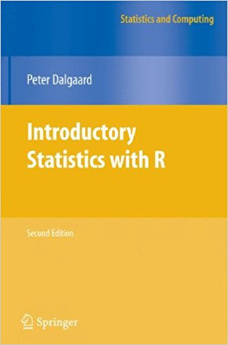
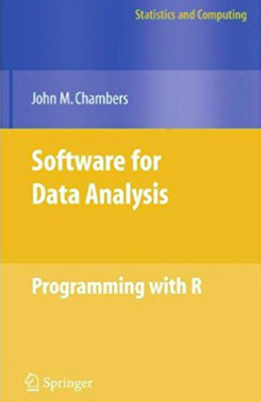
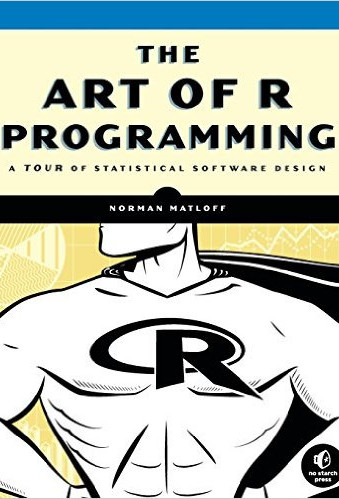
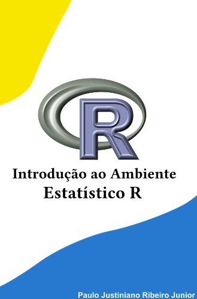
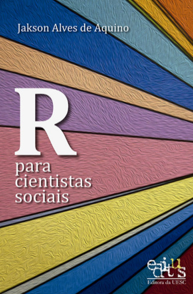
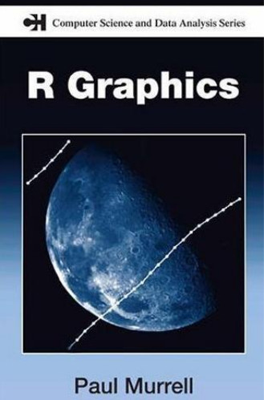

# Cronograma #

As aulas são ministradas as quartas e sextas-feira das 17h00 às 18h30 na
sala _Professor Rubens_ no pavilhão de Agroindústria, Alimentos e
Nutrição da ESALQ-USP.

```{r, echo=FALSE, eval=TRUE}

datas <- conteudos <- slides <- codes <- NULL

##-------------------------------------------
## Dia 26/04
datas[1] <- "26/Abril"
conteudos[1] <- paste(
    "Apresentação e motivação do curso;",
    "Instalação do software R;",
    "Instalação e exploração do editor RStudio.",
    collapse = "")
slides[1] <- "[Slides 01](./lecture01.html)"
codes[1] <- ""

##-------------------------------------------
## Dia 28/04
datas[2] <- "28/Abril"
conteudos[2] <- paste(
    "Operadores básicos;",
    "Classes de objetos;",
    "Conceitos da linguagem;",
    collapse = "")
slides[2] <- "[Slides 02](./lecture02.html)"
codes[2] <- ""

##-------------------------------------------
## Dia 03/05
datas[3] <- "03/Maio"
conteudos[3] <- paste(
    "Manipulação de objetos;",
    "Construção e utilização de funções;",
    collapse = "")
slides[3] <- "[Slides 03](lecture03.html)"
codes[3] <- ""

##-------------------------------------------
## Dia 05/05
datas[4] <- "05/Maio"
conteudos[4] <- paste(
    "Leitura de dados no R",
    "Manipulação de `data.frames`;"
    collapse = "")
slides[4] <- "[Slides 04 - I](lecture04.html)"
codes[4] <- ""

##-------------------------------------------
## Dia 10/05
datas[5] <- "10/Maio"
conteudos[5] <- paste(
    "Uso de funções para obtenção de estatísticas simples",
    collapse = "")
slides[5] <- "[Slides 04 - II](lecture04.html#10)"
codes[5] <- ""

##-------------------------------------------
## Dia 12/05
datas[6] <- "12/Maio"
conteudos[6] <- paste(
    "Visualização de dados usando o pacote `graphics`",
    "Exposição dos pacotes `lattice` e `ggplot2`",
    collapse = "")
slides[6] <- ""
codes[6] <- ""

##-------------------------------------------
## Dia 17/05
datas[7] <- "17/Maio"
conteudos[7] <- paste(
    "Elaboração de relatórios",
    "WYSIWYG vs linguagens de marcação",
    "Instalação de uma distribuição TeX",
    "Documentos Rmarkdown e Sweave",
    collapse = "")
slides[7] <- ""
codes[7] <- ""

##-------------------------------------------
## Dia 19/05
datas[8] <- "19/Maio"
conteudos[8] <- paste(
    "Exploração de outputs do Rmarkdown",
    "(html, pdf, docx e apresentações)",
    collapse = "")
slides[8] <- ""
codes[8] <- ""

##-------------------------------------------
## Dia 24/05
datas[9] <- "24/Maio"
conteudos[9] <- paste(
    "Introdução aos modelos lineares no R",
    "Utilização das funções `lm` e `aov`",
    "Análise de resíduos, predição e contrastes",
    collapse = "")
slides[9] <- ""
codes[9] <- ""

##-------------------------------------------
## Dia 26/05
datas[10] <- "26/Maio"
conteudos[10] <- paste(
    "Auto apresendizado no R",
    "Exploração de temas (Taks Views)",
    "Exploração de pacotes (vinhetas, páginas de ajuda, código-fonte)",
    collapse = "")
slides[10] <- ""
codes[10] <- ""

##----------------------------------------------------------------------
## Table
knitr::kable(cbind("Datas" = datas,
                   "Conteúdos" = conteudos,
                   "Materiais" = slides,
                   "Códigos" = codes)
             )

```

# Referências #

Abaixo são listados alguns livros que apresentam aspectos introdutórios
de programação em R. As capas dos livros são links para as suas
respectivas páginas ou para a página de sua publicação.

<style>
.myref {
    width: 16.5%;
    float: left;
    text-align: center;
    margin-top: 10px;
}
.myref > p > a > img {
    box-shadow: 0px 1px 15px 1px black;
}
</style>

<div class="myref">
  <a href="http://staff.pubhealth.ku.dk/~pd/ISwR.html" target="_blank">
    
  </a>
</div>

<div class="myref">
  <a href="http://www.springer.com/la/book/9780387759357" target="_blank">
    
  </a>
</div>

<div class="myref">
  <a href="https://www.nostarch.com/artofr.htm" target="_blank">
    
  </a>
</div>

<div class="myref">
  <a href="http://www.leg.ufpr.br/~paulojus/embrapa/Rembrapa/Rembrapa.pdf" target="_blank">
    
  </a>
</div>

<div class="myref">
  <a href="http://www.lepem.ufc.br/jaa/RparaCS.php" target="_blank">
    
  </a>
</div>

<div class="myref">
  <a href="https://www.stat.auckland.ac.nz/~paul/RG2e/" target="_blank">
    
  </a>
</div>
