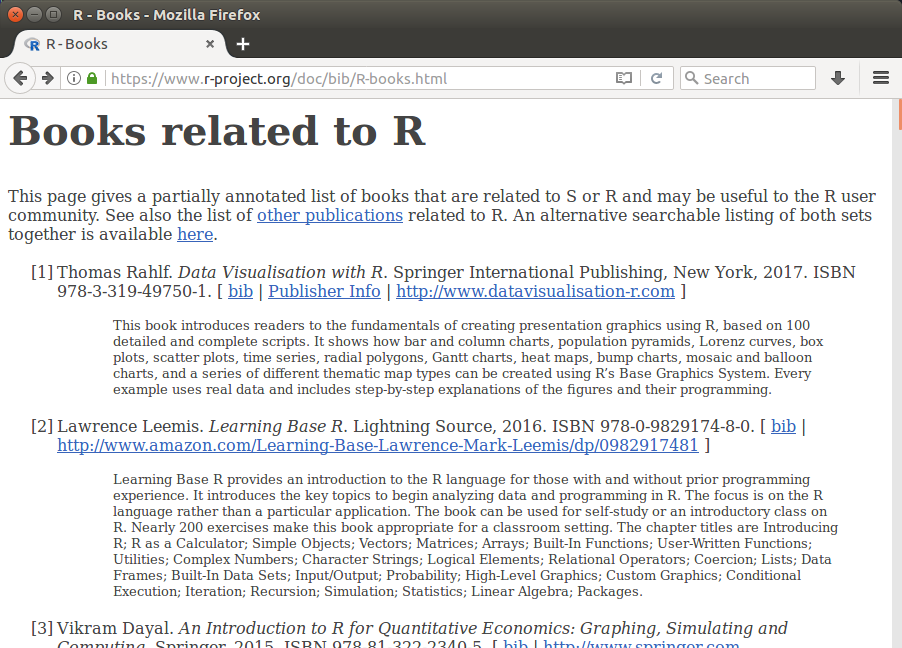
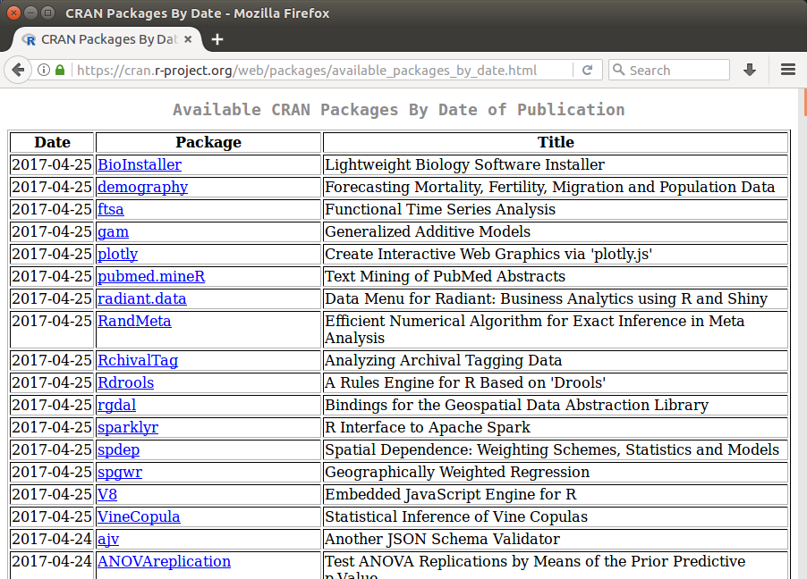
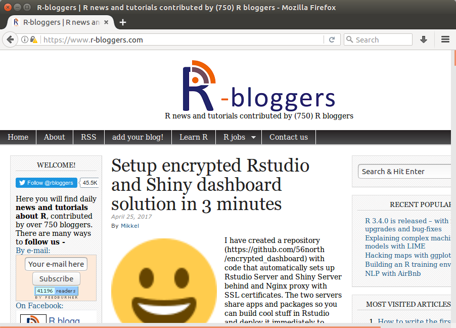
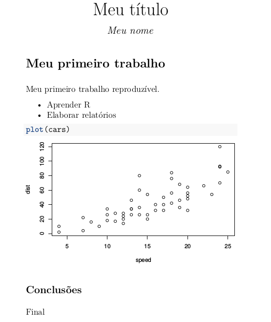
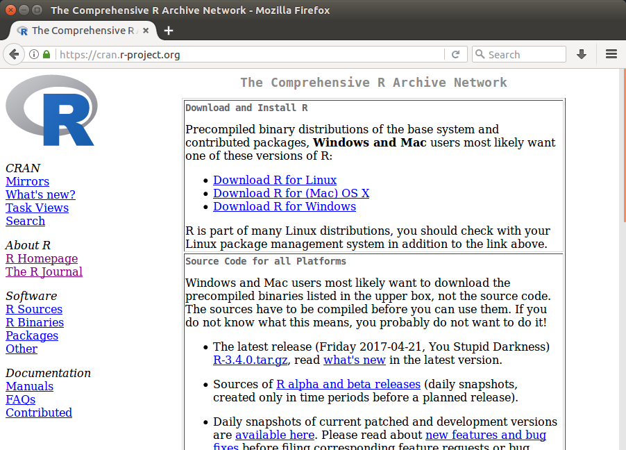

```{r include=FALSE}

library(knitr)
opts_chunk$set(
    warning = FALSE,
    message = FALSE,
    echo = FALSE,
    fig.align = "center")

library(ggplot2)
library(grid)
library(gridExtra)

## ## Alternatives highlightStyle
## arta, ascetic, dark, default, far, github, googlecode, idea, ir_black,
## magula, monokai, rainbow, solarized-dark, solarized-light, sunburst,
## tomorrow, tomorrow-night-blue, tomorrow-night-bright, tomorrow-night,
## tomorrow-night-eighties, vs, zenburn

```

## Referências ##

- Palestra do profº Paulo Justiniano (UFPR) no meetupR-SP<br>
  _Por que o R?_<br>
  <https://youtu.be/UgPX49gkby4>

- Seminário do software eng. Yihui Xie (RStudio) no RTG Seminar<br>
  _R in Stat500: Demonstration, Computing, and Graphics_<br>
  <https://cloud.github.com/downloads/yihui/yihui.github.com/ISU-Stat500-2009-Yihui-Xie.pdf>

---

class: inverse, center, middle

# O software R #

---

## Software livre ##

Além de produto gratuito.

 * Liberdade para executar/usar;
 * Liberdade para copiar;
 * Liberdade para distribuir;
 * Liberdade para estudar;
 * Liberdade para modificar;
 * Liberdade para melhorar.

---

## Linguagem de programação ##

> _There is R. There is no if. Only how._<br>
> – Simon Blomberg

--

```{r, echo=TRUE}

## Medidas resumo de todas as variáveis
dados <- mtcars
do.call(rbind, lapply(dados, summary))

```

---

## Comunidade ativa ##

Relatados <font color="red">158 livros</font> com aplicações em R.

```{r, out.width = "80%"}



```

---

## Comunidade ativa ##

Atualmente (29/08/2016) <font color="red">9.037 pacotes</font> no CRAN.

```{r, out.width = "80%"}



```

---

## Comunidade ativa ##

<font color="red">580 blogs</font> vínculados ao R-bloggers.

```{r, out.width = "80%"}



```

---

## Visualização de dados ##

```{r, fig.height=7, fig.width=10}

g1 <- ggplot(iris, aes(x = Sepal.Length, y = Sepal.Width,
                       color = Species)) +
    geom_point()

g2 <- ggplot(mtcars, aes(x = as.factor(carb), y = mpg)) +
    geom_boxplot()

g3 <- ggplot(cars, aes(x = speed, y = dist)) +
    geom_point() +
    geom_smooth()

mtcars$cyl <- as.factor(mtcars$cyl)
g4 <- ggplot(mtcars, aes(x = disp, y = mpg, color = cyl)) +
    geom_point() +
    geom_smooth(method = "lm")

grid.arrange(g1, g2, g3, g4, ncol = 2)

```

---

## Pesquisa reproduzível ##

.pull-left[

<pre style="font-size: 16px;">

---
title: Meu título
author: Meu nome
output: pdf_document
---

# Meu primeiro trabalho

Meu primeiro trabalho reproduzível.

- Aprender R
- Elaborar relatórios

`r ''````{r}
plot(cars)
`r ''````

## Conclusões

Final

</pre>

]

--

.pull-right[

```{r}



```

]

---

class: inverse, center, middle

## Como começar ##

---

## Download ##

```{r, out.width="90%"}



```

---

## Editores ##

O R é uma linguagem de programação interpretada, ou seja, comando
escrito é comando executado. Use bons editores para montar seu script,
por exemplo:

 * Emacs;
 * Vim;
 * Tinn-R;
 * **RStudio**;
 * ...

---

## RStudio ##

```{r, out.width="90%"}

knitr::include_graphics("images/rstudio1.png")

```

---

## RStudio ##

```{r, out.width="90%"}

knitr::include_graphics("images/rstudio.png")

```

---

## Tutoriais ##
