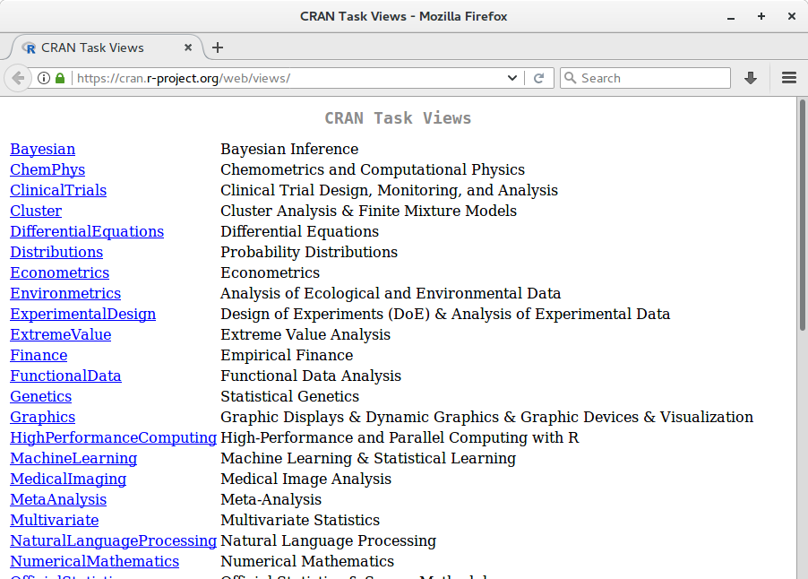

```{r include=FALSE}

library(knitr)
opts_chunk$set(
    warning = FALSE,
    message = FALSE,
    echo = TRUE,
    eval = FALSE, 
    fig.align = "center",
    comment = "")

## ## Alternatives highlightStyle
## arta, ascetic, dark, default, far, github, googlecode, idea, ir_black,
## magula, monokai, rainbow, solarized-dark, solarized-light, sunburst,
## tomorrow, tomorrow-night-blue, tomorrow-night-bright, tomorrow-night,
## tomorrow-night-eighties, vs, zenburn

```

## Objetivos ##

---
class: inverse, center, middle

# Obtendo informações pelo R #

---

## Funções de inspeção ##

Durante o curso já utilizamos diversas vezes essas funções.

Essas são as funções que em toda sessão R serão utilizadas.

```{r}

# Inspeciona a estrutura
str(objeto)

# Verifica a classe do objeto
class(objeto)

# Verifica os métodos (S3 ou S4) disponíveis
methods(class = class(objeto))       # Para uma classe 
methods(generic.function = "anova")  # De uma função

```

---

## Abrindo funções no R ##

O aprendizado em R (e em Estatística em geral) pode ser potencializado
inspecionando os códigos-fonte das funções programadas no R.

Como sabemos, o R é software livre e todos códigos de qualquer funções
estão disponíveis para estudo, melhoria e distribuição.

```{r}

# Funções comuns
cor

# Funções genéricas
anova
methods("anova") 

getAnywhere(anova.nls)
stats:::anova.nls

```

---

## Funções de procura ##

Algumas vezes lembramos apenas de parte do nome de alguma função, ou
ainda queremos verificar se existe alguma função programada que atende
determinada demandas.

No R, temos alguns funções facilitadores para procura de outras funções
ou objetos.

```{r}

# Procurando objetos por termos
apropos("glm")
apropos("Tukey")

# Procurando completa de termos nos pacotes instalados
help.search("pillai")
help.search("bonferroni")

# Procurando na web
RSiteSearch("Non-Parametric")
RSiteSearch("Mixed-Models")

```

---

## Buscando informação por grandes áreas ##

Quando se inicia o estudo em uma nova área e se pretende fazer uso do
software R, pode-se consultar as
[**Tasks Views**](https://cran.r-project.org/web/views/) listadas no
CRAN para se interar dos principais pacotes desta área.

```{r, echo=FALSE, eval=TRUE, out.width = "90%"}



```

---
class: inverse, center, middle

# Estudando os pacotes #

---

## Pacotes R ##

- As páginas de ajuda dos pacotes são extremamente utéis;
- Explore as vinhetas dos pacotes quando disponíveis;
- Explore as demostrações quando disponíveis.

```{r}

# Ajuda de um pacote
help(package = "base", help_type = "html")
help(package = "readxl", help_type = "html")

# Abre as vinhetas
browseVignettes(package = "readxl")

```

---
class: inverse, center, middle

# Git e GitHub #

---

## Sistema de versionamento Git ##

```{r, echo=FALSE, eval=TRUE, out.width = "55%"}

knitr::include_graphics("images/thesis-funny.gif")

```

## Serviço de hospedagem e ambiente colaborativo GitHub ##

```{r, echo=FALSE, eval=TRUE, out.width = "85%"}

knitr::include_graphics("images/github.png")

```

---

## Por que Git e GitHub são importantes ? ##

- Atualmente a maioria dos pacotes em R são desenvolvidos sob
  versionamento Git e hospedados no GitHub;

- Pode-se ser acesso não só ao código-fonte, como também à trajetória de
  desenvolvimento (novas características, correções de _bugs_, melhoria
  de desempenho, etc.);

- Problemas com o pacote podem ser relatados nas _issues_, inclusive o
  seu problema já pode ter sido indicado por outras pessoas;

- Caso queria você pode facilmente _clonar_ o repositório de um pacote e
  modificá-lo como quiser. 

---

## Exemplos de pacotes no GitHub ##

  - [`ggplot2`](https://github.com/tidyverse/ggplot2)
  - [`readxl`](https://github.com/tidyverse/readxl)
  - [`rmarkdown`](https://github.com/rstudio/rmarkdown/)

---
class: inverse, center, middle

# Comunidades #

---

## A boa e velha pesquisa ##

 - Google: tente procurar por termos específicos e adicione `R` à
   procura; 

 - Stackoverflow: Procure por tags `R` ou de pacotes/funções.

 - Listas de R: nacional e internacional, embora não sejam tão atiivas
   quanto antigamente, nos arquivos da lista muitas das suas dúvidas já
   podem estar resolvidas.


---
class: middle, center
background-image: url("./images/well-done.jpg")

<!-- ------------------------------------------- -->
